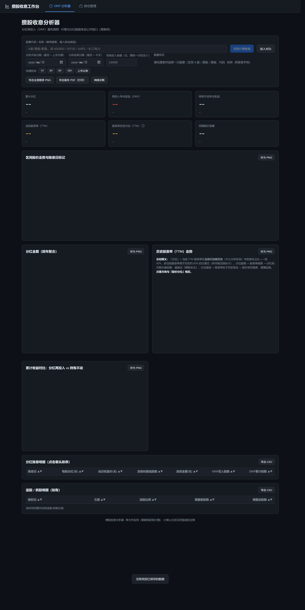
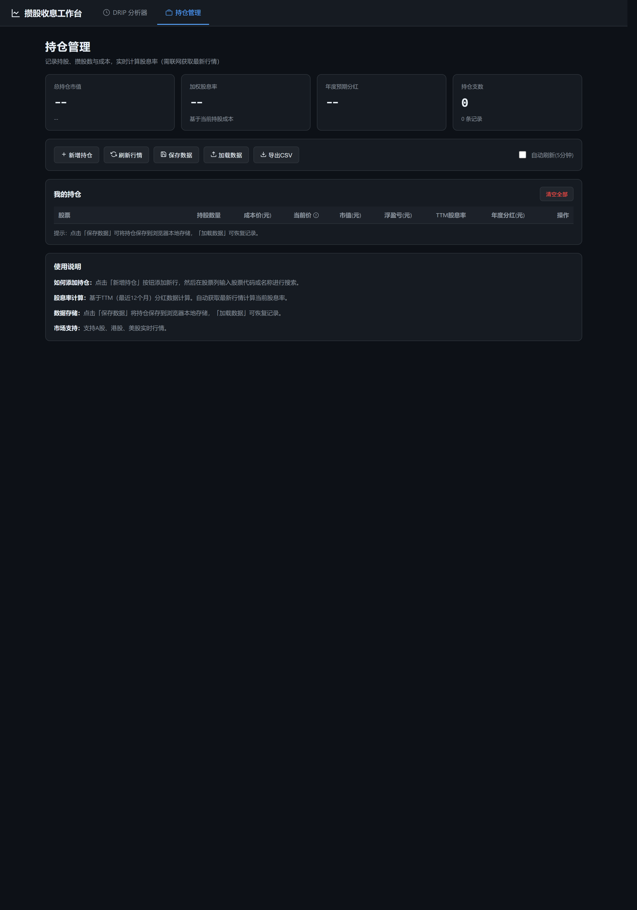

# 攒股收息分析器 · DRIP 复利测算 + 持仓管理


一个**纯前端单文件**的攒股收息工具箱:DRIP 复利测算 + 持仓管理,支持 A 股 / 港股 / 美股三市场统一。

> 双击 HTML 即可使用,无需安装、无后端、不保存任何数据(持仓除外,可选本地存储)。


*DRIP 分析器:输入代码 → 一键测算复利,六张指标卡 + 四张图*


*持仓管理:成本/市值/盈亏/累计分红,TTM 股息率跨市场统一*

---

## 一、这是什么

"攒股收息"是长期投资流派:不断积累股份、靠分红现金流获得回报。本工具围绕这一目标做了两件事:

| 模块 | 干什么 |
| --- | --- |
| **DRIP 分析器** | 把一笔期初投入(默认 ¥10,000,可自定义)放进一只股票的历史区间,模拟「分红再投入(DRIP)」与「持有不动」两种策略并测算年化收益 |
| **持仓管理** | 多只股票持仓追踪:成本基础 / 实时市值 / 盈亏 / 累计分红 / TTM 股息率,跨 A/HK/US 市场统一展示 |

两者的年化收益差距,就是"复利"在长周期里最直观的体现;持仓管理让你把"分析"和"日常跟踪"在同一页面里完成。

### 核心特性

- 🌍 **三市场统一**:同一界面分析 A 股 / 港股 / 美股,代码 / 名称自动识别
- 💰 **DRIP vs 持有不动** 长期年化收益对比(默认含碎股处理)
- 📈 **TTM 股息率 + 历史分位**:看当前息率在历史什么水位
- 📒 **持仓管理**:成本/市值/盈亏/累计分红/TTM 股息率,支持本地保存与 CSV 导出
- 🌗 **浅色 / 深色主题一键切换**,设计系统 token 驱动 UI + 图表
- 🔄 **A+H 双重上市**港币股息自动去重(避免 TTM 重复计入)
- 📤 **图表 PNG / 明细 CSV / 整页报告 PDF** 三种导出
- 🖱️ **零部署**:单文件 HTML,双击即用;丢邮箱/丢 U 盘/丢微信文件传输助手都能跑

---

## 二、快速开始

### 三步上手

1. 用现代浏览器(Chrome / Edge 等)打开 `攒股收息分析器.html`
2. **DRIP 分析**:在搜索框输入股票名称或代码 → 从下拉列表选中 → 点击「获取行情数据」
3. **持仓管理**:点击顶部「持仓管理」tab → 「新增持仓」一行行录入 → 「保存数据」存到本地浏览器

### 支持的代码格式(搜索后自动识别,一般无需手敲)

| 市场 | 示例 |
| --- | --- |
| A 股 | 上海 `600036`(或 `sh600036`)、深圳 `000858`(或 `sz000858`) |
| 港股 | `00700`(或 `hk00700`) |
| 美股 | `AAPL`(或 `usAAPL.OQ` 纳指 / `usBABA.N` 纽交所) |

---

## 三、DRIP 分析器详解

| 策略 | 做法 |
| --- | --- |
| **分红再投入(DRIP)** | 每次除息日收到现金分红后,按当日收盘价立刻买回该股,期末按收盘价结算总市值(含碎股处理) |
| **持有不动** | 分红落袋不买入,只持有期初那部分股份,期末市值 + 累计落袋现金 |

### 六张指标卡

- 累计分红
- DRIP 年化收益
- 持有不动年化收益
- 当前股息率(TTM)
- **股息率历史分位(TTM)**
- 同期股价涨幅

### 四张图

- 区间股价走势(标注每次除息日与分红金额)
- 分红金额按年聚合柱状图
- 历史股息率(TTM)走势(含分位参考线与当前值标记)
- DRIP vs 持有不动 的累计收益对比曲线

### 快捷区间与多股对比

- 快捷区间:1Y / 3Y / 5Y / 10Y / 上市以来 一键切换,也可手动指定起止日期与初始投入金额
- 多股对比:最多同时对比 8 只,分组柱状图(年化 / 股息率)+ 可点击表头排序的明细表;区间 / 金额改动会**联动重算整组**

---

## 四、持仓管理详解

> 从顶部「持仓管理」tab 进入。

### 能做什么

- 📋 **多只股票同时追踪**:每行 = 一只持仓,支持 A / 港 / 美混合
- 💵 **成本基础**:录入买入价 + 持股数,自动算成本 / 现值 / 盈亏 / 收益率
- 📊 **实时行情与分红**:拉取最新价 + 365 天 TTM 分红,显示市值 / 累计落袋 / 当前息率
- 💾 **本地保存**:点击「保存数据」写到浏览器 localStorage;「加载数据」恢复;刷新不丢
- 📤 **CSV 导出**:导出全部持仓记录(Excel 直接打开,带 BOM)
- 🗑️ **清空持仓**:一键清空(带二次确认)

### 关键设计细节

- **TTM 股息率跨市场统一**:复用 DRIP 分析器的 `fetchDividendsEm`(A 股)+ `fetchKlinesTx`(港 / 美),不重复造轮子
- **A+H 双重上市港币去重**:同时存在 A 股(以人民币派息)和 H 股(以港币派息)时,自动按 `相当于 X 港元` 前缀识别,避免 TTM 重复计入
- **半年度股息 30 天宽限期**:对于只在半年末派息一次的港股(如中国移动中期息),即使除息日落在 TTM 截止日之外 30 天内,仍能计入
- **数据可改**:买入价/股数单元格可双击编辑,改完按 Tab 自动重算该行

---

## 五、指标口径说明

> 涨跌配色遵循 A 股习惯:**红涨绿跌**。

| 指标 | 口径 |
| --- | --- |
| **DRIP 年化收益** | 分红在除息日按收盘价再投入买入;年化 =(期末总市值 / 期初投入)^(365.25 / 持有天数) − 1 |
| **持有不动年化** | 分红落袋为现金不买入,按期末市值 + 累计现金计算同式年化 |
| **当前股息率(TTM)** | 最近 365 天每股分红合计 / 最新收盘价 |
| **股息率历史分位(TTM)** | 当前 TTM 股息率在**已加载的全部历史**交易日中的排名占比。如 60% = 高于历史约 60% 的交易日。**分位越高 → 股息率越高 → 分红相对股价越划算**(注意方向与"股价分位"相反:股价分位越高越贵) |
| **同期股价涨幅** | 区间内期末收盘价相对期初收盘价的涨跌幅(未计入分红) |
| **持仓盈亏率** | (当前市值 − 成本基础) / 成本基础,未计税费与分红落袋 |
| **累计分红(持仓)** | 365 天 TTM 内每股分红 × 持股数;A/HK/US 分别按人民币 / 港元 / 美元展示 |

---

## 六、主题与设计

- **浅色 / 深色主题** 右上角一键切换,选择写入 localStorage,刷新后保持
- **设计系统**:全 UI 由 token 驱动(颜色 / 字体 / 间距),便于后续定制
- **ECharts 同步**:坐标轴 / 网格 / 缩放边框 / 图例 / Tooltip 随主题自动反色,无需手动刷新
- **微交互**:按钮 hover、卡片悬浮、表格行高亮、过渡 150-250ms

---

## 七、数据来源

- **行情 K 线**:腾讯财经(`web.ifzq.gtimg.cn`,fetch 主源),备用东方财富
- **A 股分红 / 送转**:东方财富数据中心 `RPT_SHAREBONUS_DET` 接口
- **港股 / 美股分红与拆股**:腾讯 K 线数据的除息信息("末期息 3.4 港元"、"每股分配 0.25 美元"、"送红股"、"1 拆 N" 等文本解析)
- **股票搜索**:东方财富 suggest API

所有接口均需联网访问;页面**不向后端上传任何输入**;持仓数据仅保存在你浏览器的 localStorage,清除浏览器数据会丢失。

---

## 八、技术实现

- **单文件交付**:HTML + CSS + 原生 JavaScript 全部内联于一个 HTML(约 1.1 MB,其中 ECharts 5 图表库内联),无任何外部依赖,离线可打开
- **架构分层**:
  - 数据层:JSONP / fetch 封装各市场行情与分红源,归一化为统一交易日序列
  - 计算层:`computeCore` 等纯函数负责 DRIP 模拟、年化、TTM、分位等指标,便于测试与复用
  - 展示层:指标卡、ECharts 图表、对比表、持仓表均从同一份计算结果渲染,保证口径一致
- **本地验证**:项目内可用 Node `vm` 沙箱对页面脚本做语法校验与函数级冒烟测试(无需启动浏览器)

---

## 九、目录结构

```
stock-dividend-analyzer/
├── 攒股收息分析器.html     # 全部功能所在,双击即用
├── README.md              # 本文件
├── CHANGELOG.md           # 版本更新日志
├── LICENSE                # MIT 协议
└── docs/
    ├── screenshot-drip.png       # DRIP 分析器截图
    └── screenshot-portfolio.png  # 持仓管理截图
```

---

## 十、版本沿革

> 完整更新日志见 [CHANGELOG.md](CHANGELOG.md)。

- **v6.0**:持仓管理 + 浅色 / 深色主题 + 设计系统 token + A+H 港币去重 + 30 天 TTM 宽限 + 一批 bug 修复
- **v5.2**:明细 CSV 导出(分红 / 送转 / 多股对比三表)与整页报告打印导出(`@media print` 浅色反转 + 打印前图表换高清图)
- **v5.1**:图表 PNG 导出(ECharts 原生 `getDataURL`,支持单张与全部导出)
- **v5**:快捷区间按钮、区间与金额全局联动重算对比组、指标口径释义标注、移除手动录入(纯在线工具)
- **v4**:支持港股与美股(分红改由腾讯 K 线文本解析)
- **v3**:自定义初始金额、历史股息率分位、多股对比(≤ 8 只)
- **v2**:改为在线获取行情与分红,去掉 CSV
- **v1**:纯离线 CSV 手动解析

---

## 十一、注意事项

- 历史行情与分红均来自公开接口,可能存在延迟或缺失,结果仅供研究参考,**不构成任何投资建议**
- 分红方案以接口披露为准;复权 K 线按前复权口径展示,叠加除息日信息模拟再投入
- 上市不足所选区间的股票会自动对齐至上市日;停牌期间以实际交易日为准
- 若页面无数据,请先使用「网络诊断」确认数据源可达,再检查网络环境
- 持仓数据保存在**当前浏览器**的 localStorage,换浏览器/清缓存会丢,记得用「保存数据」按钮备份

---

## 十二、常见问题

**Q: 打开 HTML 后一片空白 / 没数据?**
A: 90% 是数据源被网络拦截。打开浏览器 DevTools(F12)→ Network,确认能否访问 `web.ifzq.gtimg.cn` 和东方财富数据中心。也可使用页面内「网络诊断」按钮。

**Q: 持仓数据安全吗?会不会上传?**
A: 不会。持仓只写到当前浏览器的 localStorage,清浏览器数据会丢,建议定期用「保存数据」按钮手动备份。

**Q: 支持 ETF / 基金 / REITs 吗?**
A: 目前仅支持 A / 港 / 美普通股票。ETF 的派息节奏与除息日规则不同,暂未适配。

**Q: 移动端能用吗?**
A: 浏览器能开就能用,但布局以桌面优先。手机上看会拥挤,小屏建议横屏。

**Q: 跟雪球 / 同花顺 / Wind 数字对不上?**
A: 数据源(腾讯/东财)与商业软件口径可能略有差异(分红日 / 复权方式 / 拆股处理)。本工具明确给出指标口径,严格按公开数据计算,差异在合理范围内。

**Q: 港股 A+H 双重上市的股票会不会重复算分红?**
A: 不会。`parseFHContent` 已处理:只取 `相当于 X 港元` 前缀行,纯人民币行视为 H 股不派港币股息而跳过。

**Q: 为什么没有"全市场扫描"功能?**
A: 暂未实现。当前为单股分析 + 持仓跟踪,不做全市场排序。后续规划中。

**Q: 怎么贡献 / 提建议?**
A: 提 Issue 或 PR 都欢迎。单文件架构意味着改动都在一个 HTML 里,改完本地双击验证即可,门槛很低。

---

*Made for 攒股收息长期主义者。慢慢攒,慢慢收。*
